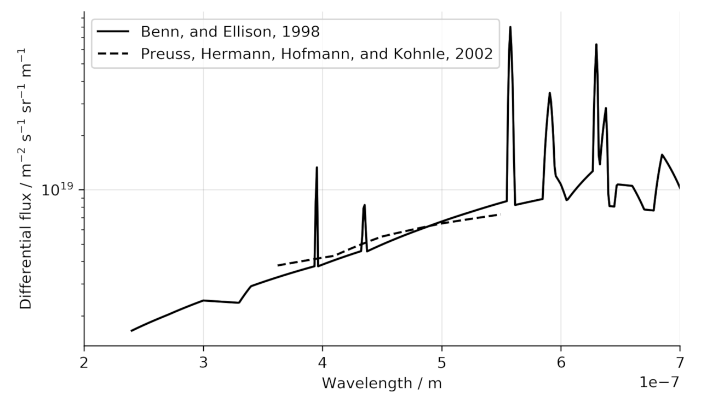
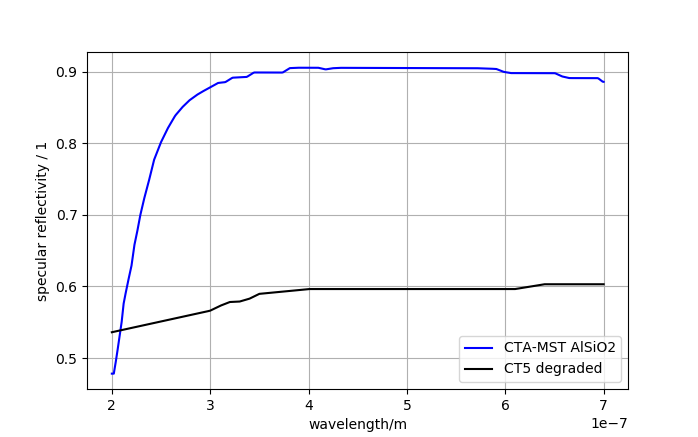
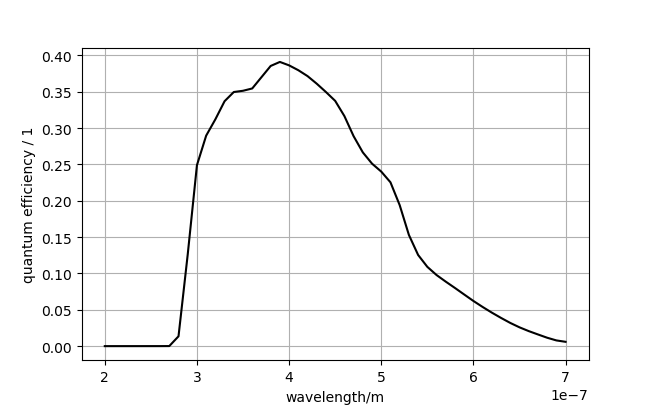

# Crosscheck with Cherenkov-telescope H.E.S.S. CT5

## Abstract
To crosscheck the tools and algorithms used in the simulation for the Cherenkov-plenoscope, we perform a crosscheck with an existing Cherenkov-telescope. We will only compare on the trigger-level. We choose to compare with the 5th telescope named 'CT5' in the [High Energy Stereoscopic System](https://www.mpi-hd.mpg.de/hfm/HESS/) as it is the largest Cherenkov-telescope in 2020. Here we collect CT5's public information to feed our simulations. The H.E.S.S. collaboration estimates the instrument-response of CT5 using tools based on sim_telarray by Konrad Bernloehr. We will estimate the response to diffuse pools of gamma-rays, electrons, protons, and helium nuclei.


Image taken from [H.E.S.S. web pages](https://www.mpi-hd.mpg.de/hfm/HESS/pages/about/telescopes/) (2017 July 21). The large telescope in the middle is CT5.

See also: https://github.com/cherenkov-plenoscope/aperture_history

### Period
We choose the period of CT5 after its upgrade to a FlashCam image-sensor in late 2019.
The H.E.S.S. internal name of this period seems to be `phase2d`, with the latest variant
```
phase2d1
```

### Site
Namibia, Khomas Highland, Goellschau Farm.
```
"observation_level_asl_m": 1800,
"earth_magnetic_field_x_muT": 12.5,
"earth_magnetic_field_z_muT": -25.9,
"corsika_atmosphere_id": 10,
"geomagnetic_cutoff_rigidity_GV": 12.5,
```

### Pointing
only near zenith.
```
"azimuth_deg": 0.0,
"zenith_deg": 0.0
```

### Night-sky-background-light
I pick a flux representative for the 1,500h to 2,000h darkest hours of observation-time in a year. I choose the measurement by 
Benn and Allison on La Palma [gaug2013night] as a reference here. We use the flux as it is measured, we do not scale it.



See also: https://github.com/cherenkov-plenoscope/photon_spectra

```
@article{gaug2013night,
    title={Night Sky Background Analysis for the Cherenkov Telescope Array using the Atmoscope instrument},
    author={Gaug, Markus and others},
    journal={arXiv preprint arXiv:1307.3053},
    year={2013}
}
```
La Palma's night-sky is pretty much compatible with the one in Namibia:
```
@article{preuss2002study,
    title={Study of the photon flux from the night sky at La Palma and Namibia, in the wavelength region relevant for imaging atmospheric Cherenkov telescopes},
    author={Preuss, S and Hermann, G and Hofmann, W and Kohnle, A},
    journal={Nuclear Instruments and Methods in Physics Research Section A: Accelerators, Spectrometers, Detectors and Associated Equipment},
    volume={481},
    number={1},
    pages={229--240},
    year={2002},
    publisher={Elsevier}
}
```
## Telescope

### Imaging reflector
```
"outer_diameter_m": 28.0,
"focal_length_m": 36.0,
"outer_facet_diameter_m": 0.9,
"facet_shape": "hexagonal",
"geometry": "parabolic",
"mirror_reflectivity_vs_wavelength": 83% of the CTA MST Al SiO2 mirrors
```

```
@inproceedings{cornils2005optical,
  title={The optical system of the HESS II telescope},
  author={Cornils, R and Bernl{\"o}hr, Konrad and Heinzelmann, G{\"o}tz and Hofmann, Werner and Panter, Michael},
  booktitle={International Cosmic Ray Conference},
  volume={5},
  pages={171},
  year={2005}
}
```

#### Masts
The masts running from the imaging-reflector to the image-sensor do block light.
Their average transmission is estimated to be:
```
0.925.
```

#### Mirrors
The mirror-reflectivity is assumed to have degraded by a factor of ```0.71``` since its initial installation. This is based on Muon-calibration. The Figure shows CT5's mirror-reflectivity together with the reflectivity of the CTA-MST AlSiO2 mirrors.



```
@proceeding{doi: 10.1117/12.2025476,
    author = { G.  Pareschi,T.  Armstrong,H.  Baba,J.  Bähr,A.  Bonardi,G.  Bonnoli,P.  Brun,R.  Canestrari,P.  Chadwick,M.  Chikawa,P.-H.  Carton,V.  de Souza,J.  Dipold,M.  Doro,D.  Durand,M.  Dyrda,A.  Förster,M.  Garczarczyk,E.  Giro,J.-F.  Glicenstein,Y.  Hanabata,M.  Hayashida,M.  Hrabovski,C.  Jeanney,M.  Kagaya,H.  Katagiri,L.  Lessio,D.  Mandat,M.  Mariotti,C.  Medina,J.  Michalowski,P.  Micolon,D.  Nakajima,J.  Niemiec,A.  Nozato,M.  Palatka,M.  Pech,B.  Peyaud,G.  Pühlhofer,M.  Rataj,G.  Rodeghiero,G.  Rojas,J.  Rousselle,R.  Sakonaka,P.  Schovanek,K.  Seweryn,C.  Schultz,S.  Shu,F.  Stinzing,M.  Stodulski,M.  Teshima,P.  Travniczek,C.  van Eldik,V.  Vassiliev,Ł  Wiśniewski,A.  Wörnlein,T.  Yoshida},
    title = {Status of the technologies for the production of the Cherenkov Telescope Array (CTA) mirrors},
    journal = {Proc.SPIE},
    volume = {8861},
    number = {},
    pages = {8861 - 8861 - 19},
    year = {2013},
    doi = {10.1117/12.2025476},
    URL = {https://doi.org/10.1117/12.2025476},
    eprint = {}
}
```

### Image sensor
```
"pixel_field_of_view_diameter_deg": 0.0796,
"field_of_view_diameter_deg": 3.4,
"quantum_efficiency_vs_wavelength": "Hamamatsu R12992-100"
```
The pixel-spacing is ```50.0```mm what corresponds to ```0.0796```deg at ```36.0```m focal-length.

The CT5 camera contains a mixture of Hamamatsu R12992-100 and R11920-100 PMTs.
```Measurement of PMTs by Oleg Kalekin, University Erlangen, March 2018```

Convolved with the transmission of the entrance-window of flash-cam, The figure below shows the effective photon-detection-efficiency.



Public measurements of prestine sample of such PMTs can be obtained from reference below.
```
@article{MIRZOYAN2017603,
  title = "Evaluation of novel PMTs of worldwide best parameters for the CTA project",
  journal = "Nuclear Instruments and Methods in Physics Research Section A: Accelerators, Spectrometers, Detectors and Associated Equipment",
  volume = "845",
  pages = "603 - 606",
  year = "2017",
  note = "Proceedings of the Vienna Conference on Instrumentation 2016",
  issn = "0168-9002",
  doi = "https://doi.org/10.1016/j.nima.2016.06.080",
  url = "http://www.sciencedirect.com/science/article/pii/S0168900216306416",
  author = "R. Mirzoyan and D. Müller and J. Hose and U. Menzel and D. Nakajima and M. Takahashi and M. Teshima and T. Toyama and T. Yamamoto"
}
```
The average transmission of the reflective funnels infron of the photo-multiplier-tubes is estimated to be:
```
0.9.
```
However, this 'loss' will not be explicitly taken into account in our simulation of a ```CT5```-like plenoscope because the plenoscope's lenses show very similar acceptances.

### Sum-trigger
```
"integration_time_duration_s": 8e-9,
"threshold_pe": 60,
"num_pixel_to_be_summed_up": 9,
```

The effective integration time of the digital trigger filter is approximately 8 ns.

```
@article{sailer2019trigger,
  title={Trigger performance verification of the FlashCam prototype camera},
  author={Sailer, S and Werner, F and Hermann, G and Barcelo, M and Bauer, C and Bernhard, S and Biegger, M and Canelli, F and Capasso, M and Diebold, S and others},
  journal={Nuclear Instruments and Methods in Physics Research Section A: Accelerators, Spectrometers, Detectors and Associated Equipment},
  volume={936},
  pages={392--393},
  year={2019},
  publisher={Elsevier}
}
```

### Focussing
```
"object_distance_to_focus_on_m": 15e3,
```

```
@article{krayzel2013improved,
  title={Improved sensitivity of HESS-II through the fifth telescope focus system},
  author={Krayzel, F and Maurin, G and Brunetti, L and Dubois, J-M and Fiasson, A and Journet, L and Lamanna, G and Leflour, T and Lieunard, B and Monteiro, I and others},
  journal={arXiv preprint arXiv:1307.6461},
  year={2013}
}
```

## Public instrument-responses

Effective area for gamma-rays. Not on trigger-level, but after several cuts in the period 2013-2015:
```
@article{abdalla2018first,
  title={First ground-based measurement of sub-20 GeV to 100 GeV $\gamma$-Rays from the Vela pulsar with HESS II},
  author={Abdalla, H and Aharonian, F and Benkhali, F Ait and Ang{\"u}ner, EO and Arakawa, M and Arcaro, C and Armand, C and Arrieta, M and Backes, M and Barnard, M and others},
  journal={Astronomy \& Astrophysics},
  volume={620},
  pages={A66},
  year={2018},
  publisher={EDP Sciences}
}
```
