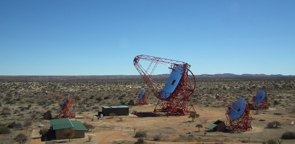

# Crosscheck with Cherenkov-telescope H.E.S.S. CT5

## Abstract
To crosscheck the tools and algorithms used in the simulation for the Cherenkov-plenoscope, we perform a crosscheck with an existing Cherenkov-telescope. We choose to compare with the 5th telescope named 'CT5' in the [High Energy Stereoscopic System](https://www.mpi-hd.mpg.de/hfm/HESS/) as it is the largest Cherenkov-telescope in 2020. Here we collect CT5's public information to feed our simulations. The H.E.S.S. collaboration estimates the instrument-response of CT5 using tools based on sim-tel-array by Konrad Bernloehr. We will use the tools of the Cherenkov-plenoscope. We will only compare on the trigger-level.



Image taken from [H.E.S.S. web pages](https://www.mpi-hd.mpg.de/hfm/HESS/pages/about/telescopes/) (2017 July 21). The large telescope in the middle is CT5.

### Periode
I choose the periode of CT5 after its upgrade to a FlashCam image-sensor in mid 2019.
Internal name of this periode:
```
phase2d0 to
phase2d1
```

### Site
Namibia, Khomas Highland, Goellschau.
```
"observation_level_asl_m": 1800,
"earth_magnetic_field_x_muT": 12.5,
"earth_magnetic_field_z_muT": -25.9,
"corsika_atmosphere_id": 10,
"geomagnetic_cutoff_rigidity_GV": 12.5,
```

### Pointing
only near zenith.
```
"azimuth_deg": 0.0,
"zenith_deg": 0.0
```

### Night-sky-background-light
I pick a flux representative for the 1,500h to 2,000h darkest hours of observation-time in a year. I choose the measurement by 
Benn and Allison on La Palma [gaug2013night] as a reference here.

```
@article{gaug2013night,
    title={Night Sky Background Analysis for the Cherenkov Telescope Array using the Atmoscope instrument},
    author={Gaug, Markus and others},
    journal={arXiv preprint arXiv:1307.3053},
    year={2013}
}
```
La Palma's night-sky is pretty much compatible with the one in Namibia:
```
@article{preuss2002study,
    title={Study of the photon flux from the night sky at La Palma and Namibia, in the wavelength region relevant for imaging atmospheric Cherenkov telescopes},
    author={Preuss, S and Hermann, G and Hofmann, W and Kohnle, A},
    journal={Nuclear Instruments and Methods in Physics Research Section A: Accelerators, Spectrometers, Detectors and Associated Equipment},
    volume={481},
    number={1},
    pages={229--240},
    year={2002},
    publisher={Elsevier}
}
```

# Telescope

### Imaging reflector
```
"outer_diameter_m": 28.0,
"focal_length_m": 36.0,
"outer_facet_diameter_m": 0.9,
"facet_shape": "hexagonal",
"geometry": "parabolic",
"mirror_reflectivity_vs_wavelength": "???"
```

```
@inproceedings{cornils2005optical,
  title={The optical system of the HESS II telescope},
  author={Cornils, R and Bernl{\"o}hr, Konrad and Heinzelmann, G{\"o}tz and Hofmann, Werner and Panter, Michael},
  booktitle={International Cosmic Ray Conference},
  volume={5},
  pages={171},
  year={2005}
}
```

Image sensor
------------
I think this is before FlashCam:
```
"pixel_field_of_view_diameter_deg": 0.0667,
"field_of_view_diameter_deg": 3.2,
"quantum_efficiency_vs_wavelength": "???"
```

Is FlashCam using "PMT Hamamatsu R11920-100-05"?

Sum-trigger
-----------
This is for FlashCam itself. Not sure if this is the same in CT5.
```
"integration_time_duration_s": 4e-9,
"threshold_pe": [50, 100],
"num_pixel_to_be_summed_up": 9,
```

```
@article{sailer2019trigger,
  title={Trigger performance verification of the FlashCam prototype camera},
  author={Sailer, S and Werner, F and Hermann, G and Barcelo, M and Bauer, C and Bernhard, S and Biegger, M and Canelli, F and Capasso, M and Diebold, S and others},
  journal={Nuclear Instruments and Methods in Physics Research Section A: Accelerators, Spectrometers, Detectors and Associated Equipment},
  volume={936},
  pages={392--393},
  year={2019},
  publisher={Elsevier}
}
```

### Focussing
```
"object_distance_to_focus_on_m": 12e3,
```

```
@article{krayzel2013improved,
  title={Improved sensitivity of HESS-II through the fifth telescope focus system},
  author={Krayzel, F and Maurin, G and Brunetti, L and Dubois, J-M and Fiasson, A and Journet, L and Lamanna, G and Leflour, T and Lieunard, B and Monteiro, I and others},
  journal={arXiv preprint arXiv:1307.6461},
  year={2013}
}
```
