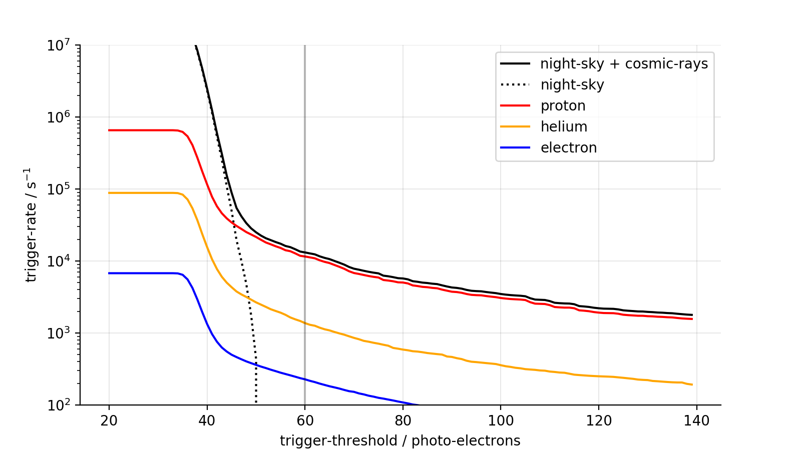
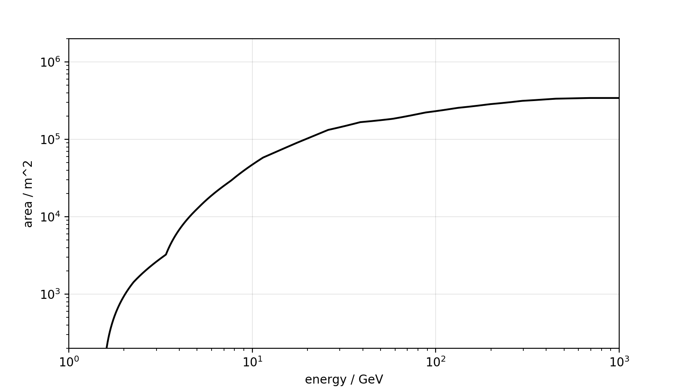
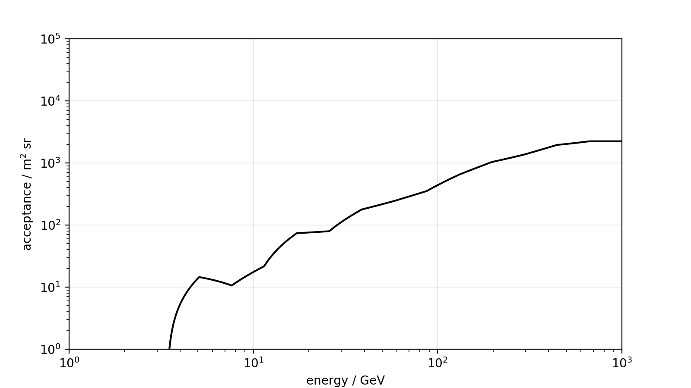
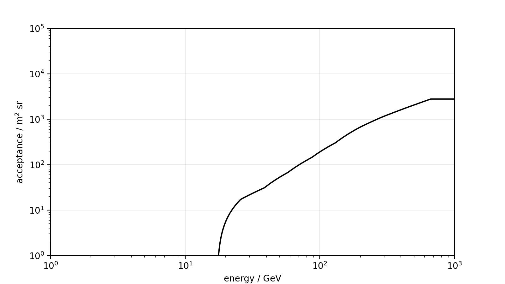
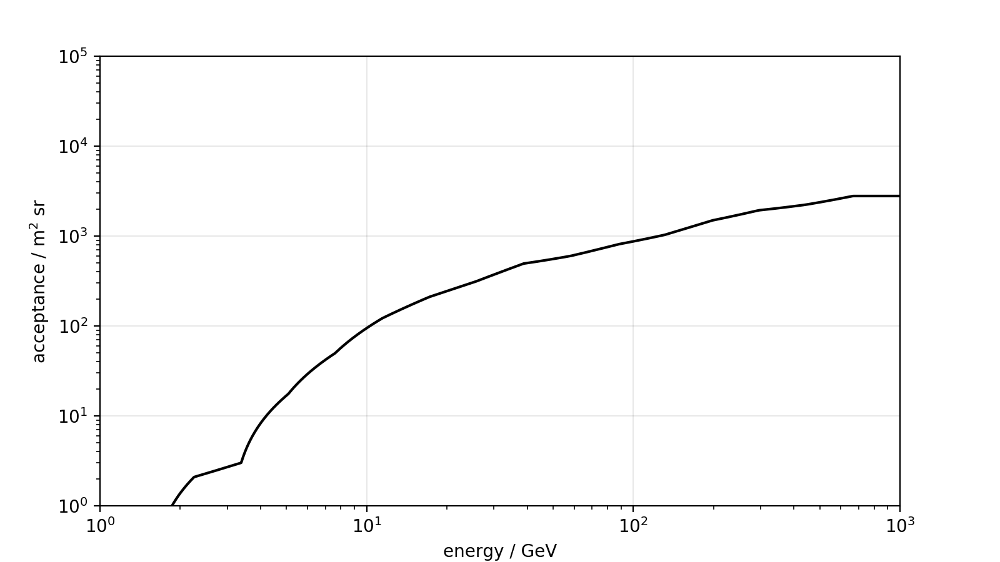
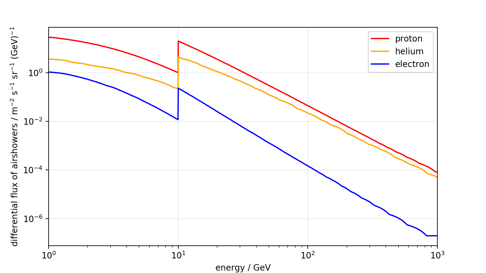

# 2020 May 30
Estimating the instrument-resonse of H.E.S.S. CT5 on trigger-level using the simulation-tools of the Cherenkov-plenoscope.

## Ratescan


The rates below a trigger-threshold of ```40 p.e.``` do saturate, and do not grow further because of limited statistics.
The effective areas, and acceptances are for a trigger-threshold of ```60 p.e.```, see vertical line.

## Effective area for gamma-rays


## Effective acceptance (area x solid angle) for cosmic-rays

### Proton



### Helium



### Electron + Positron



## Flux of airshowers



This is used to integrate the trigger-rates shown in the ratescan.
The flux of airshowers in earth's atmosphere is based on the flux of cosmic-rays outside of earth's atmosphere and the geomagnetic cutoff. Here we assume that the flux of airshowers below a rigidity of ```~10GV``` is reduced down to ```5%```.

```
@article{patrignani201730,
  title={30.1. primary spectra},
  author={Patrignani, C and others},
  journal={URL http://pdg. lbl. gov/2017/reviews/rpp2017-rev-cosmic-rays. pdf}
}

@article{aguilar2015precision,
  title={
      Precision measurement of the proton flux in primary cosmic rays from
      rigidity 1 GV to 1.8 TV with the Alpha Magnetic Spectrometer on the
      International Space Station},
  author={
      Aguilar, M and
      Aisa, D and
      Alpat, B and
      Alvino, A and
      Ambrosi, G and
      Andeen, K and
      Arruda, L and
      Attig, N and
      Azzarello, P and
      Bachlechner, A and
      others},
  journal={Physical Review Letters},
  volume={114},
  number={17},
  pages={171103},
  year={2015},
  publisher={APS}
}

@article{aguilar2014precision,
  title={
    Precision measurement of the (e++ e-) flux in primary cosmic rays
    from 0.5 GeV to 1 TeV with the Alpha Magnetic Spectrometer on the
    International Space Station
  },
  author={
    Aguilar, M and
    Aisa, D and
    Alpat, B and
    Alvino, A and
    Ambrosi, G and
    Andeen, K and
    Arruda, L and
    Attig, N and
    Azzarello, P and
    Bachlechner, A
    and others
  },
  journal={Physical review letters},
  volume={113},
  number={22},
  pages={221102},
  year={2014},
  publisher={APS}
}

```
