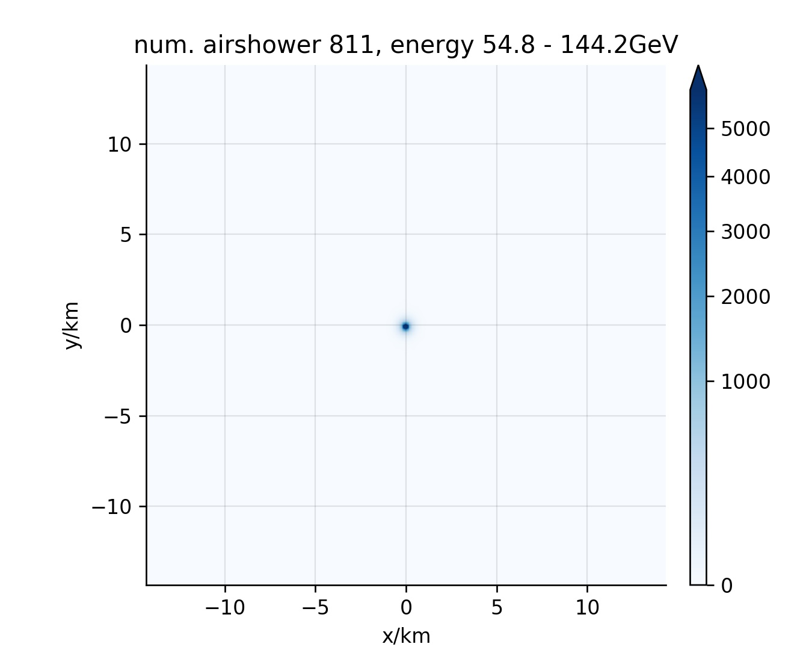

# 2020 June 3
```starter_kit``` commit ```f13f3f35d```.

### Changes:
- reduced mirror-reflectivity based on degradation known from Muon-calibration.

- reduced photon-detection-efficiency for Photo-multiplier-tubes based on more representative maesurements done by Oleg Kalekin.

### Summary:

- Trigger-rate is now ```~7ks^{-1}```, this is ~3 times lower compared to the estimate in ```2020-May-30``` .


## Ratescan


The rates below a trigger-threshold of ```40 p.e.``` do saturate, and do not grow further because of limited statistics.
The effective areas, and acceptances are for a trigger-threshold of ```60 p.e.```, see vertical line.

## Effective area for gamma-rays


## Effective acceptance (area x solid angle) for cosmic-rays

### Proton


### Helium


### Electron + Positron


## Triggerprobability vs. true Cherenkov-size


| Gamma         | Proton        | Helium  | Electron |
| ------------- | ------------- | ------- | -------- |
|  |  |  |  |

## Triggerprobability vs. angle between pointing and primary

| Gamma         | Proton        | Helium  | Electron |
| ------------- | ------------- | ------- | -------- |
|  |  |  |  |

## Cherenkov-pool on observation-level

Gamma

| Gamma         | Proton        | Helium  | Electron |
| ------------- | ------------- | ------- | -------- |
|  |  |  |  |
|  |  |  |  |
|  |  |  |  |
|  |  |  |  |
|  |  |  |  |
|  |  |  |  |
|  |  |  |  |
|  |  |  |  |
|  |  |  |  |
|  |  |  |  |

## Flux of airshowers

same as for 2020-May-30.